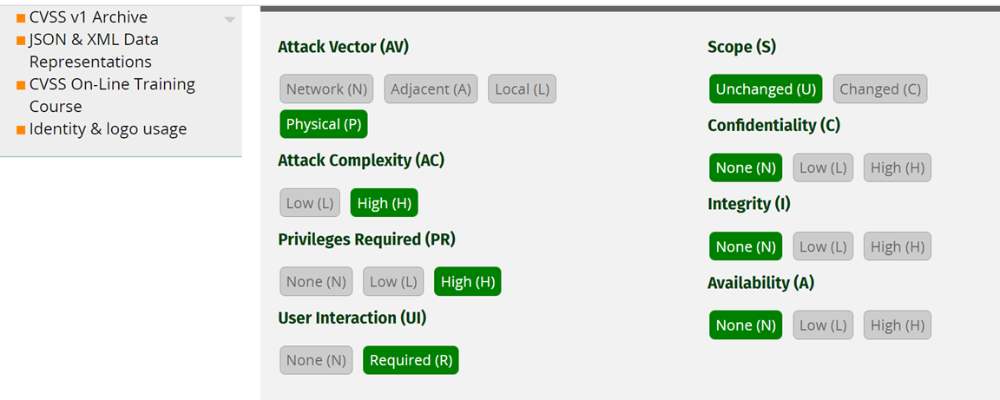

## 2.3 程式與開發安全

## Windows `Secure` programming

```
[77]下列何者不是 Windows 安全開發必須注意的地方？ 
(A) Socket 設計 (B) 多執行緒設計 (C) 常駐程式設計 (D) 封包流量設計 
```
D

## [程式碼簽署(Code Signing)](https://zh.wikipedia.org/wiki/%E4%BB%A3%E7%A0%81%E7%AD%BE%E5%90%8D)  [[Code Signing]](https://en.wikipedia.org/wiki/Code_signing)
- 代碼簽章（英語：Code signing）是對`執行檔`或`程式碼`進行`數位簽章`
- 目的==> 確認`軟體作者`及保證軟體在簽章後`未被修改或損壞`的措施。
- 技術==> 使用`雜湊(a cryptographic hash)`來驗證真實性和完整性

```
[125]程式碼簽署(Code Signing)無法提供以下哪一項功能?
(A) 確認軟體開發者的身份
(B) 防止程式碼被篡改
(C) 用戶端認證
(D) 程式碼執行時期的合法性識別
```
C

## 原始碼漏洞修補
```
[128]關於原始碼漏洞修補,下列敘述何者不正確?
(A) 所有類型的原始碼漏洞,均可找到對應的弱點掃描方法
(B) 未經驗證的使用者參數,均應加以驗證
(C) SQL Injection的源頭可能來自於 Web 頁面,亦可能來自資料庫本身資料
(D) XSS的源頭可能來自於瀏覽器的 Document Object Model(DOM)
```
A

## 通用漏洞評分系統(Common Vulnerability Scoring System,CVSS)



- 漏洞評鑑系統(Common Vulnerability Scoring System；CVSS) 由美國國家基礎建設諮詢委員會 (NIAC) 委託製作
- CVSS 是一套公開的評鑑標準，經常被用來評比企業資訊科技系統的安全性，並受到eBay、賽門鐵克(Symantec)、思科(Cisco)、甲古文(Oracle)等眾多軟體廠商支援。
- 由於CVSS是運用數學方程式來判定某特定網路的安全性是否存在弱點，普遍被認為較具中立性。


[官方網址](https://www.first.org/cvss/)

- CVSS的判定標準，不但包含威脅的嚴重性，遠端網路是否能遙控資安漏洞、利用網路弱點，攻擊者是否需要登入才會產生威脅等等，都被列入評比。
- CVSS的評分分數從0分到10分，0代表沒有發現弱點，而10則代表最高風險。


- 基本指標群(Base metric group)
- 暫時指標群(Temporal metric group)
- 環境指標群(Environmental metric group)


```
[中級2.(單選題)] 
通用漏洞評分系統(Common Vulnerability Scoring System,CVSS)
是一個可衡量漏洞嚴重程度的公開標準。
CVSSv3 以基本指標群(Base metric group)、暫時指標群(Temporal metric group)及
環境指標群(Environmental metric group)等 3 個群組來進行判斷。

關於基本指標群,下列何者「不」是其考量因素?
(A)機密性衝擊(Confidentiality Impact)
(B)攻擊途徑(Attack Vector)
(C)攻擊複雜度(Attack Complexity)
(D)可靠性衝擊(Reliability Impact)
```

D
### 逆向工程（Reverse Engineering）

```
[76]安全性測試人員可以使用反組譯器（Disassemblers）、除錯器 （Debuggers）
和反編譯器（Decompilers）來判斷與檢查，是否存在何種程式碼的弱點？ 
(A) 缺乏逆向工程（Reverse Engineering）保護 (B) 注入缺失（注射缺陷） 
(C) 跨網站指令碼（Cross-Site Scripting） (D) 不安全的物件參考（Insecure Direct Object Reference） 
```
```
A
編譯器（compilers）
c ==> gcc
c++ ==> g++
dev-c++

除錯器Debuggers ==> gdb

開發
c ==> 組合語言assemble language [intel vs AT&T]==> 執行檔{windows: PE   vs  Linux: ELF}

逆向 ==> IDA Pro  | Ghidra
c <== 組合語言assemble language [intel vs AT&T]  <==執行檔[機器語言]{windows: PE   vs  Linux: ELF}

組譯器（Disassemblers）==>把組合程式變成執行檔

https://en.wikipedia.org/wiki/GNU_Assembler
   gas as


https://awesomeopensource.com/projects/disassembler
https://en.wikibooks.org/wiki/X86_Disassembly/Disassemblers_and_Decompilers

反組譯器（Disassemblers）==> 
除錯器 （Debuggers）
反編譯器（Decompilers）
```


```
https://montcs.bloomu.edu/Information/LowLevel/Assembly/assembly-tutorial.html

	hello:     db 'Hello world!',10    ; 'Hello world!' plus a linefeed character
	helloLen:  equ $-hello             ; Length of the 'Hello world!' string
	                                   ; (I'll explain soon)

section .text
	global _start

_start:
	mov eax,4            ; The system call for write (sys_write)
	mov ebx,1            ; File descriptor 1 - standard output
	mov ecx,hello        ; Put the offset of hello in ecx
	mov edx,helloLen     ; helloLen is a constant, so we don't need to say
	                     ;  mov edx,[helloLen] to get it's actual value
	int 80h              ; Call the kernel

	mov eax,1            ; The system call for exit (sys_exit)
	mov ebx,0            ; Exit with return code of 0 (no error)
	int 80h


nasm -f elf hello.asm

ld -s -o hello hello.o

./hello
```
```
[127]關於逆向工程,下列敘述何者正確?
(A) 從組合語言恢復高階語言的結構與語法過程
(B) 從機器語言恢復高階語言的結構與語法過程
(C) 從高階語言恢復組合語言的結構與語法過程
(D) 從高階語言恢復機器語言的結構與語法過程
```
B
### 行動程式開發安全性

```
[130]下列對行動碼(Mobile code),下列敘述何者不正確?
(A) 通常不具傷害性
(B) 可在不同作業系統之間執行
(C) 可在不同瀏覽器上順利執行
(D) 無法從遠端系統傳到本地端執行
```
D

### 沙箱(Sandbox)

- 沙盒（英語：sandbox，又譯為沙箱）是一種安全機制
- sandbox為執行中的程式提供的`隔離環境`。
- 通常是作為一些來源不可信、具破壞力或無法判定程式意圖的程式提供實驗之用。
- sandbox通常嚴格控制其中的程式所能存取的資源，比如，sandbox可以提供用後即回收的磁碟及記憶體空間。
- 在sandbox中，網路存取、對真實系統的存取、對輸入裝置的讀取通常被禁止或是嚴格限制。
- 從這個角度來說，沙盒屬於`虛擬化`的一種。
- sandbox中的所有改動對作業系統不會造成任何損失。
- 這種技術被電腦技術人員廣泛用於測試可能帶毒的程式或是其他的惡意代碼(malware)。

### 沙箱逃逸(sandbox escape)攻擊

- [Windows核心和Chrome瀏覽器的零時差漏洞已被駭客串聯發動攻擊，現在先更新Chrome，Windows修補還在路上(林妍溱|2020-11-02)](https://www.ithome.com.tw/news/140861)


```
[124]Android 系統的核心層級應用程式沙箱(Sandbox)是以何種方式來提供安全性?
(A) 每個應用程序指定唯一的使用者識別碼(UID),並執行於獨立的處理程序中
(B) 於非特權群組識別碼(GID)下執行所有應用程式
(C) 限制核心處理程序進行非法讀取
(D) 防止任何未經授權的核心處理程序執行
```
A

## buffer overflow ==> stack ==> 區域變數(local variable)

```
# include<stdio.h>

int main(){

   printf("Hello World!\n");
   return 0;
}
```

## PART2.安全軟體發展生命週期(Security Software DevelopmentLifecycle, SSDLC)
```
SSDLC  vs SDLC
SDLC (Software Development Life Cycle)：
軟體發展生命週期(也有稱系統發展生命週期)
進行階段分為： 需求->分析->設計->開發->測試->佈署維運 

SSDLC (Secure Software Development Life Cycle)：
安全的軟體發展生命週期(Secure SDLC 或 S-SDLC)，
從專案開始的各階段(需求->設計->開發->測試->佈署維運)

方法論:
(1)Cigital–TouchPoint Model 
(2)MS-SDL 
(3)OWASP-CLASP  SAMM
CLASP
Comprehensive, Lightweight Application Security Process
綜合性輕量級應用安全過程

  https://www.chainnews.com/zh-hant/articles/764295548
```

## [微軟安全開發周期](https://docs.microsoft.com/zh-tw/windows/security/threat-protection/msft-security-dev-lifecycle)

### SSDLC流程
```
需求分析(Requirements) ==> 進行風險分析與確認應用程式的資安需求，以符合使用者需求與法規遵循為目的

架構設計(Design)==> 根據需求分析結果，進行包含系統任務的目標、功能關聯、邊界範圍及各階層使用者的角色等
                    內外部使用的規劃與搭配適當的資安架構

程式實作(Implementation) ==> 落實既有之規劃，將使用者介面、功能運作及安全性等完整的實現
                             程式設計師應隨時注意正確安全的程式撰寫習慣

測試與驗收(Testing) ==> 依據資安需求擬訂測試計畫，並依測試計畫進行測試與修正
                         確保各項功能與安全性皆可符合既定的需求
部署與維運(Maintenance) ==> 進行軟體之部署，安排教育訓練
                           落實軟體之穩定運作，應定期修補漏洞(Patch)、
                           按步升級更新版本(Upgrade)及即時監控(Monitor)
```

```
[126]下列何者為目前撰寫安全程式碼的知名的業界參考指引?
(A) NIST SP 800 系列
(B) OWASP 指南
(C) FIPS 系列
(D) ISO22301 相關標準
```
```
B

撰寫安全程式碼 ==> OWASP 

OWASP Application Security Verification Standard (ASVS) ver.4 (2019)

OWASP Secure Coding Practices
   https://owasp.org/www-pdf-archive/OWASP_SCP_Quick_Reference_Guide_%28Chinese%29.pdf

OWASP Top Ten Proactive Controls (2018)
OWASP Top Ten Risks (2017)
OWASP Testing Guide v4(2014)
OWASP Cheatsheet Series

https://cheatsheetseries.owasp.org/cheatsheets/DotNet_Security_Cheat_Sheet.html

安全程式碼  secure coding
Secure Coding in C and C++, 2/e (Paperback)
Robert C. Seacord  Addison Wesley  2013-04-11

萬無一失的程式碼－終結 C & C ++ 軟體漏洞 (Secure Coding in C and C++, 2/e)
Robert C. Seacord 著、賈蓉生、蔡旻嶧 譯  博碩文化 2014-12-30

The CERT C Secure Coding Standard (Paperback)
Robert C. Seacord  Addison Wesley  2008-10-01
https://www.itread01.com/content/1548583221.html

https://github.com/wkevin/CERTcn

CERT Coding Standards 包括了几门语言的编码规范：
The CERT C Secure Coding Standard
The CERT C++ Secure Coding Standard
The CERT Oracle Secure Coding Standard for Java
The CERT Perl Secure Coding Standard

https://ctts.nccst.nat.gov.tw/Download

NIST SP 800 系列:https://csrc.nist.gov/publications/sp800
```

```
[27]下列何者屬於開發安全方面需注意的問題？ 
(A) 部署時必須考量伺服器效能，避免導致應用程式效能低 
(B) 應用程式設計必須設計多線程，用戶能對服務隨時存取 
(C) 應用程式必須考量是否有 SQL 注入漏洞 
(D) 應用程式必須考量 License 限制，避免出現無法部署其他伺服器 
```
```
C

(B) 應用程式設計必須設計多線程[multi-thread]，用戶能對服務隨時存取 ===>效能問題 不是安全問題
```
```
[123]安全的系統發展生命週期(Secure Software Development Life Cycle,SSDLC)
意指發展一套安全系統的順序,
用以開發完善安全的資訊系統。以下哪個不是安全的系統發展生命週期階段?
(A) 設計
(B) 需求
(C) 估價
(D) 開發
```
C

```
[中級3.(單選題)] 
關於安全軟體發展生命週期(Security Software DevelopmentLifecycle, SSDLC),
下列敘述何者正確?
(A)可區分為需求階段、設計階段、開發實作階段、測試階段以及部署維運階段
(B)可區分為 UI/UX 階段、設計階段、開發實作階段、測試階段以及部署維運階段
(C)可區分為需求階段、設計階段、測試階段、以及部署維運階段
(D)可區分為 UI/UX、設計階段、測試階段以及部署維運階段
```
A
