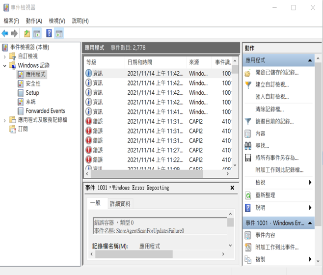

# 3_3_日誌管理
```
日誌(log)

各式各樣的日誌:日誌格式
   作業系統的日誌
     Windows作業系統的日誌
     Linux作業系統的日誌
   伺服器的日誌
     Apache伺服器的日誌
   網路設備的日誌
     iptable日誌
     snort日誌
     modsecurity日誌
     
日誌分析
    DNS分析工具dnstop
    LogParser
    彩色日志工具ccze
    動態日志查看工具logstalgia
    三維日志顯示工具gource
    LogAnalyzer
        http://www.weithenn.org/2012/03/netadmin-74.html

日誌管理
	SAWMILL稽核日誌報表系統
  Kiwi_Syslog_Server
syslog
http://linux.vbird.org/linux_basic/0570syslog.php
http://pxnet2768.pixnet.net/blog/post/71799543
https://stackify.com/syslog-101/
```

# 各式各樣的日誌:日誌格式

## 作業系統的日誌

### UNIX/LINUX分三個子系統:
```
系統日誌

(1)`登陸時間`日誌子系統==>存放在   var/log/wtm   和  var/run/utmp
(2)行程統計日誌子系統
(3)`錯誤`日誌子系統 ==> 存放在/var/log/messages/

基於syslogd的日誌文件 
Syslogd依優先程度分8級: 0~7
通常是ASCII碼(名瑪)的文件格式

作業系統紀錄日誌文件分兩類
  1.對登陸人員進行記錄的lastlog
  2.系統郵件伺服器運行時紀錄的maillog
```

```
應用程式產生的日誌
  通常是ASCII碼的文件格式
  程式會將日誌傳往syslogd並統一處理

大部分應用層的日誌會儲存在/var/log/messages/

Apache的日誌 會儲存於/var/log/httpd/access_log
Samba 則儲存在/var/log/samba
```

### Syslog
- Syslog == 系統日誌或系統記錄
- Syslog是一種用來在網際網路協定（TCP/IP）的網路中傳遞`記錄檔(log)`訊息的標準。
- syslog 協定
  - syslog協定屬於一種主從式協定
  - syslog發送端會傳送出一個小的文字訊息（小於1024位元組）到`syslog接收端(伺服器)`。
  - `syslog接收端(伺服器)`通常名為「syslogd」、「syslog daemon」或syslog伺服器。
  - 系統日誌訊息可以被以UDP協定(port 514)及╱或TCP協定((TCP) port 6514)來傳送。
  - 這些資料是以`明碼`型態被傳送。
  - 不過由於SSL加密外套（例如Stunnel、sslio或sslwrap等）並非syslog協定本身的一部分，因此可以被用來透過SSL／TLS方式提供一層加密。
  - syslog通常被用於`資訊系統管理`及`資安稽核`。
  - 雖然它有不少缺陷，但仍獲得相當多的裝置及各種平台的接收端支援。
  - 因此syslog能被用來將來自許多不同類型系統的日誌記錄整合到集中的儲存庫中。
  

## Windows 日誌 ==> 使用事件檢視器(event viewer)



- WINDOWS 日誌分類 分三種
  - 1.系統日誌           
  - 2.安全日誌           
  - 3.應用程式日誌       

- Windows日誌採binary(二進制)
- 通常使用事件檢視器(event viewer)或第三方日誌分析工具讀取
- 日誌存放地點:
```
1.Windows 2000 Advanced Server
應用程式：C:\WINNT\system32\config\Appevent.Evt
安全：C:\WINDOWS\System32\config\SecEVENT.Evt
系統：C:\WINDOWS\System32\config\SysEvent.Evt

2.Windows Server 2003企業版
應用程式：C:\WINDOWS\system32\config\Appevent.Evt
安全：C:\WINDOWS\System32\config\SecEVENT.Evt
系統：C:\WINDOWS\System32\config\SysEvent.Evt

3.Windows Server 2008 標準版
應用程式：%SystemRoot%\System32\Winevt\Logs\Application.evtx
安全：%SystemRoot%\System32\Winevt\Logs\Security.evtx
系統： %SystemRoot%\System32\Winevt\Logs\System.evtx

4.windows Vista\Windows 7\windows 8\windows 10 日誌情況
應用程式：%SystemRoot%\System32\Winevt\Logs\Application.evtx
安全：%SystemRoot%\System32\Winevt\Logs\Security.evtx
系統： %SystemRoot%\System32\Winevt\Logs\System.evtx
```
## Apache 日誌分析
- Apache 分兩類:
  - 1.access.log 有多少外國駭客來我家 ==>
    - 1.進行網站流量統計
    - 2.查看用戶訪問時間
    - 3.紀錄ip得知用戶來自哪裡
    - 4.紀錄用戶訪問的web資源而知道頁面點擊率
  - 2.error.log
- Apache預設日誌位置在 
  - Apache配置文件/etc/apache2/apache2.conf中定義為Customlog /var/log/apache2/access_log.combined

- Access Log
- The access log contains information about requests coming in to the web server. 
- This information can include what pages people are viewing, the success status of requests, and how long the server took to respond.
```
10.185.248.71 - - [09/Jan/2015:19:12:06 +0000] 808840 
"GET /inventoryService/inventory/purchaseItem?userId=20253471&itemId=23434300 HTTP/1.1" 500 17 "-" 
"Apache-HttpClient/4.2.6 (java 1.5)"
```
- Error Log
- The error log contains information about errors the web server encountered when processing requests, such as missing files. 
- It also includes diagnostic information about the server itself
```
[Thu Mar 13 19:04:13 2014] [error] [client 50.0.134.125] File does not exist: /var/www/favicon.ico
```

# 日誌分析
### 用LogParser分析Windows系統日誌
#### LogParser 概述
```
LogParser 可以實現對不同日誌的分析 
是微軟自己的日誌分析工具
```
#### LogParser 結構
```
LogParser 主要有三部分:
1.輸入處理器
2.數據引擎
3.輸出處理器	

輸入處理器支持日誌格式外還可以讀取逗號分隔(.CSV)的文件
輸入處理器把每個日誌型態轉換為統一格式
然後數據引擎處理輸入數據產生結果後
輸出處理器接手並且格式化該結果輸出到一個表裡面。
輸出處理器支援多種文件格式
```
### Iptables 日誌分析
```
Iptables日誌大致有五方面:
  1.消息發送源ip位址
  2.消息目的ip
  3.消息流向
  4.消息內容
  5.應用


任何連接、請求 例如:TCP、UDP、ICMP、流量信息、建立時間等
Iptables日誌都會逐一體現在文件裡面
```
# 日誌管理
### SAWMILL
```
http://www.etruserve.com.tw/sawmill_info.htm

Sawmill 8能支援800種以上的設備或應用程式日誌 。
可透過多種網路傳輸方式讀取log檔案進行切割，存入後端資料庫中進行分析、並產生報表。同時可設定條件偵測事件發出郵件警告。
採用SQL相容資料庫，可快速統計、篩選、關聯日誌事件。
內建syslog伺服器，可自動分類存檔，並壓縮10:1大小。
Raw Log完全唯讀，並具有連續SHA-1檢核報表，證明日誌完整性。
具備聚焦功能，可快速靈活產生ISO27001、SOX、HIPAA等客制報表。
具備條件式過濾功能，可以任何關鍵字、時間作為條件顯示報表。
能自訂條件產生各種報表存檔，或以E-Mial排程定時寄出。　　

支援SNMP網管協定、自我健康檢測與維護、Raw Log自動化SHA-1校驗碼報表及核對機制、
一鍵更新修正日誌格式支援、設定備份至外部磁碟等功能。
運行於64bit，多核心處理器之作業平台，能快速處理大量資料。
```
### 3.3日誌管理[3-4題]

### 日誌管理基本觀念
```
[41]請問系統管理人員登入成功或失敗，是否需留存相關紀錄？ 
(A) 登入成功不需要，登入失敗需要 (B) 登入成功需要，登入失敗不需要 
(C) 登入成功和失敗都需要         (D) 登入成功和失敗都不需要 
```
C
```
[38]關於系統日誌的管理與分析，下列敘述何者不正確？ 
(A)每天不斷產生的日誌，資料量龐大，往往超出人力可以判讀的範 圍 
(B)預設的 Syslog 本身沒有加密，但是不會遭到偽冒攻擊 
(C)混合式攻擊手法普遍，很難從單一設備上解讀出攻擊手法的資訊 
(D)不同設備所產生的日誌格式可能不一樣，會造成彙整上的困難 
```
B
```
[90]請問「主要記錄系統本身登入/登出行為，例如系統管理人員透過遠端登入系統等」係下列哪個記錄檔之功能？ 
 (A) 系統日誌檔 (B) 應用程式日誌檔 (C) 安全性日誌檔 (D) 網路日誌檔
```
C
```
[91]「留存日誌」是為了達成資訊安全的何種特性？ 
(A) 機密性（Confidentiality） (B) 可用性（Availability） 
(C) 可靠性（Reliability） (D) 不可否認性（Non-Repudiation） 
```
D
```
[89]關於「系統日誌」應該採取的適當保護措施，下列敘述何者不正確？ 
(A) 防止侵害個人隱私，不須記錄使用者識別碼   (B) 防止系統日誌被未經授權的存取 
(C) 防範日誌記錄檔被修改或刪除               (D) 防範超過媒體記錄容量時所產生的錯誤 
```
A


```
[140]請問若某公司的系統管理員,將所有稽核日誌存放於另一台獨立的日誌伺服器(Log Server),
並指派非管理系統之專人管理該伺服器,其最重要的目的為?
(A) 方便加密     (B) 確保機密不外洩   (C) 保護日誌   (D) 降低資安事件發生時的處理時間
```
C
```
[141]許多公司會將不同設備的日誌(Log)蒐集到同一個平台進行管理,
但因為不同設備之日誌格式、命名方式不盡相同,
此時為了方便分析,通常會對這些日誌進行什麼處理?
(A) 正規化(Normalization)    (B) 去識別化(De-identification)
(C) 最佳化(Optimization)     (D) 初始化(Initialization)
```
A
```
[138]在一個組織或安全網域內,相關的資訊系統須有一致性的同步時脈(鐘訊同步),其主要的目的為何?
(A) 確保作業系統的完整性
(B) 防範資料的漏失
(C) 為了系統作業的方便
(D) 確保稽核日誌的準確性,以便紀錄事件與生成證據
```
D

### Windows 作業系統日誌檔
```
[39]Windows 作業系統中的事件檢視器，有三個較為重要之日誌檔，請問 此三個日誌檔分別為下列何者？ 
(A) 連結性日誌、系統日誌、應用程式日誌 (B) 安全性日誌、網路日誌、應用程式日誌 
(C) 安全性日誌、系統日誌、本機防毒日誌 (D) 安全性日誌、系統日誌、應用程式日誌
```
D
```
請問主要記錄系統程式所有活動行為,例如主機或伺服器發生異常活
動狀況等,是指下列哪個紀錄檔之功能?
(A) 系統日誌檔    (B) 應用程式日誌檔   (C) 安全性日誌檔   (D) 網路日誌檔
```
A


### Syslog ==> 
```
[88]關於 Syslog 系統日誌或系統記錄，下列敘述何者不正確？ 
(A) Syslog 是一種用來在 TCP/IP 網路中傳遞記錄檔訊息的標準 (B) Syslog 系統日誌訊息可以被以 UDP 協定及 TCP 協定來傳送 
(C) Syslog 通常被用於資訊系統管理及資安稽核               (D) Syslog 是以明碼型態被傳送，無法透過 SSL 或 TLS 方式加密 
```
```
D

Syslog常被稱為系統紀錄檔或系統記錄，是一種用來在網際網路協定的網路中傳遞記錄檔訊息的標準。
這個詞彙常用來指涉實際的syslog 協定，或者那些送出syslog訊息的應用程式或資料庫。 
syslog協定屬於一種主從式協定：syslog發送端會傳送出一個小的文字訊息到syslog接收端。

Top 8 Apache Log Analyzer Tools - 2020
https://cllax.com/top-8-apache-log-analyzer-tools.html
```

## 3.4.網路安全防禦技術
```
防火牆(Firewall)
  封包過濾防火牆(Packet-Filtering Firewall)
  狀態檢視防火牆(Stateful Inspection Firewall)
  代理伺服器(Proxy Server)
  網站應用程式防火牆(Web Application Firewall)
入侵偵測與防禦系統
虛擬私有網路(VPN)
防毒系統
垃圾郵件過濾系統
端點偵測及回應系統
```

- [Sophos 被評為 2021年度 Gartner Magic Quadrant 的 Endpoint Protection Platforms (端點防護平台) 領域的領導者](https://www.fairline.com.tw/news.php?act=view&id=100)

## [資安服務](https://www.nccst.nat.gov.tw/SecuritySupplier?lang=zh)

- SOC監控
- 弱點掃描(Network|web Vulnerability Assessment)
- 滲透測試(Penetration Testing)
- 資安健檢
- 社交工程演練


## 防火牆
- 可以是一台專屬的硬體
- 也可以是架設在一般硬體上的軟體
- 功能 ==>
- 運作原理==>依照特定的`規則(rule)`允許或限制傳輸的資料通過
- 用途 ==>
  - 區隔不同安全等級網段 (如外部網路、內部網路及DMZ)
  - 過濾資料封包，避免未經授權存取內部網路資源
  - 提供稽核與控制存取網路資源
- 部署方式
  - 依資安需求，妥善劃分IP網段與LAN網路
  - 最好建置2台防火牆並設定成`高可靠度(High Availability)`運作模式，當主要防火牆出現問題時，次要防火牆即接手主要防火牆的工作
- 防火牆的管理:
  - `規則`應定期盤查
  - 存取規則的`變更`應建立管理程序(變更申請、核准及記錄)
  - 存取紀錄(log)應即時匯出存檔，並保留足夠的時間
  - 定期產出異常存取統計分析報表，進行異常處理
- 防火牆的採購:

## 防火牆的類型與技術
- 封包過濾防火牆(Packet-Filtering Firewall)
- 狀態檢視防火牆(Stateful Inspection Firewall)
- 代理伺服器(Proxy Server)
- 網站應用程式防火牆(Web Application Firewall)


```
[54]請問防火牆的功能為？ 
(A) 檢核原始碼安全 (B) 保護網路安全 (C) 保護實體安全 (D) 保護人員安全
```
B

```
[107]下列設備中,何者是可避免內外直接連線並隱藏內部 IP 位址?
(A) 封包過濾防火牆(Packet-Filtering Firewall)
(B) 狀態檢視防火牆(Stateful Inspection Firewall)
(C) 代理伺服器(Proxy Server)
(D) 網站應用程式防火牆(Web Application Firewall)
```
C
```
[57]有一種防火牆的功能如下：「檢查來源端及目的端的 IP 位址、埠號 （Port），
若有符合網路安全管理人員所設定的安全規則就准許通過，
否則拒絕其進入。」請問此為何種防火牆的描述？ 
(A)應用代理閘道（Application-Proxy）防火牆 (B)狀態檢查（Stateful inspection）防火牆 
(C)封包過濾（Packet Filter）防火牆 (D) 個人（Personal）防火牆 
```
C


## 入侵偵測系統與入侵防禦系統
- 用途: 
  入侵偵測系統==> 識別網路的異常行為與攻擊行為(注意：SSL加密連線的內容無法識別)
  入侵防禦系統==> 特定之攻擊行為可以立即阻擋
- 技術類型
  - 1.`特徵碼`比對(`signature`-based)|種子
    - 比對攻擊特徵碼、判斷較精準
    - 只能偵測已知攻擊
    - 無法偵測未知攻擊
    - 無法偵測沒有規則的攻擊模式
  - 2.`異常行為模式`分析(`anomaly`-based) ==> 先建立`正常行為` , 凡不屬於正常的 就是 `異常`
    - 智慧型技術或統計分析比對出異常行為
    - 能偵測未知類型攻擊
    - 較易誤判(太多)
  - 3.狀態協定分析
    - 事先定義完整協定行為
    - 較為精準，可偵測未知類型攻擊
    - 耗費運算資源，影響系統效能


```
[142]關於雙因素認證常見的媒介,下列敘述何者不正確?
(A) Email   (B) 簡訊   (C) 智慧卡   (D) 密碼
```
D

```
 [中級8.(單選題)] 
公司收到主管機關要求,必須每年進行網路資安健檢,下列何者方式較「不」符合?
(A)遠端網路弱點掃描(Network Vulnerability Assessment)
(B)遠端滲透測試(Penetration Testing)
(C)到場網頁應用程式弱點掃描(Web Vulnerability Assessment)
(D)到場網路安全備援服務
```
D
```
[中級11.(單選題)] 
如果網站遭遇入侵行為,在採取風險應變處置及改善時,下列敘述何者較「不」正確?
(A)用防火牆或網站應用程式防火牆(Web Application Firewall, WAF)先暫時將此風險做偵測跟阻擋
(B)採用弱掃工具或滲透測試服務驗證是否完成修補
(C)使用原始碼檢測確認是否有其他類似弱點
(D)將被網站備份資料復原即可
```
D


## Email安全性
```
[108]在寄送電子郵件時,可以運用安全電子郵件簽章/密碼技術,以確保資訊的哪些特性?
(1) 機密性    (2) 完整性    (3) 可用性  (4) 鑑別性

(A) (1), (2), (3)
(B) (1), (2), (4)
(C) (1), (3), (4)
(D) (2), (3), (4)
```
B

## 虛擬私有網路(VPN)
- 用途
  - virtual private network， 
  - 在公開的網路上建立`虛擬`的`私有``通道` ==> 通道(Tunnel)技術
  - 保護通訊資料的機密性與完整性  ==> 沒有 可用性  別白癡！
- VPN類型
  - 遠端使用者存取VPN：外勤人員透過網際網路與內部網路建立安全通道 Fortinet VPN client
  - Site-to-Site VPN：總部與分支之內部網路透過網際網路建立安全通道
  - Extranet VPN：與`合作夥伴`間透過網際網路建立安全通道(注意存取權限的控管)

```
「虛擬私有網路(VPN)」主要是透過什麼技術來建立網路上的安全通訊連線？ 
(A) 通道(Tunnel)技術 (B) 資料壓縮技術 (C) 調變與解調變技術 (D) 無線通訊技術
```
A
```
[135]下列何者技術可保護資料傳輸過程安全?
(A) 身分驗證    (B) 加密   (C) 電子簽章   (D) 雜湊函數
```
B


## 端點偵測及回應(Endpoint Detection and Response) ==>  EDR | MDR | XDR
- 能持續不斷地蒐集端點設備的活動資訊，並執行預測、防護、檢測、回應的防禦工作
- 當資安事件發生時就能有效率的阻擋並追蹤威脅事件的活動軌跡
  - 預測：蒐集終端的運行狀態與行為模式等資料，利用數據分析，識別終端存在的風險，並對可能遭受的攻擊進行預測
  - 防護：終端遭受網路攻擊時，藉由行為模式識別與規則匹配，及時阻斷攻擊行為
  - 檢測：持續檢測終端的運行狀態、風險點及不符合規定項目，例如:開啟的服務、開放的port、異常操作等，提供修復措施 
  - 回應：在安全事件發生後，及時清除攻擊代碼，修復漏洞或關閉服務，防止再次被攻擊
- AI強化

## 蜜罐（Honeypot）
```
[40]Bob 過去兩週一直在試圖滲透一個遠端的生產系統。 某一次，他能夠進入系統，並使用該系統三週的時間。 
殊不知，執法機構也正在記錄他的每一項活動，並在後來成為證據。 該組織使用一種虛擬環境來捕獲 Bob。 
這種虛擬環境是什麼？
(A) 一種用來困住駭客的蜜罐技術     (B) 一種使用特洛伊木馬的命令系統 
(C) 一種用來困住登入後使用者的環境 (D) 一種用來困住登入前使用者的環境
```
A
```
[92]關於雲端蜜罐（Honeypot）技術，下列敘述何者不正確？ 
(A) 任何攻擊蜜罐的行為都是可疑的                                         (B) 通常設置在真正的運作環境之中 
(C) 偽裝成有利用價值的網路、資料或電腦系統，並在裡面設置漏洞， 誘使駭客攻擊 (D) 為取得電腦病毒樣本的其中一種方法 
```
B

## 滲透測試(Penetration Testing)  vs 紅隊演練 (Red Team Assessment) 

```
https://devco.re/services/red-team
https://en.wikipedia.org/wiki/Red_team
```


```
[139]企業委託信賴的第三方團隊，對企業網路目標範圍進行安全性評估，找出存在的弱點或錯誤安全設定問題;
並藉此瞭解員工對各種攻擊異常事件的反應。該進行哪種測試?
(A) 原始碼測試( Source Code Review)    (B) 壓力測試(Stress Testing)
(C) 迴歸測試(Regression Testing)       (D) 滲透測試( Penetration Test)
```
D
```
https://ithelp.ithome.com.tw/articles/10000009
(A)源碼檢測是最基本的網頁程式稽核方式。透過對原始碼的檢查，挖掘已知或未知的網頁問題。

https://www.itread01.com/content/1545650131.html
(B)壓力測試
和負載測試差不多
不是在常規條件下執行手動或自動測試，而是在計算機數量較少或系統資源匱乏的條件下執行測試。
通常要進行壓力測試的資源包括內部記憶體、CPU 可用性、磁碟空間和網路頻寬等。一般用併發來做壓力測試。
(C)迴歸測試是指在發生修改之後重新測試先前的測試以保證修改的正確性

https://ithelp.ithome.com.tw/articles/10000009
(D)滲透測試( Penetration Test)
驗證所知弱點的可行性，以駭客或惡意使用者的角度對目標進行驗證，分析受測系統的風險層級。
```
```
[137]將不同的設備或不同時間的日誌進行比對，強化判斷是否為真正資安事件之動作，稱之為?
(A) 根因分析(Root Cause Analysis)    (B) 關聯分析(Correlation)
(C) 暫時解決方案(Workaround)          (D) 升級(Escalation)
```
B
```
根本原因分析（RCA，Root cause analysis）
旨在找到問題的根本原因，是分析問題、解決問題的一種「治本」的方式。

https://kknews.cc/tech/9yjxg55.html
關聯分析(Correlation)
挖掘關聯現象，從大量數據當中發現事物、特徵或者數據之間的，頻繁出現的相互依賴關係和關聯關係。
```


```
[中級20.(複選題)] 
企業進行客戶會員網站的滲透測試時,應該要注意下列哪些項目,以確保滲透測試的範圍完整性?
(A)網站暴露在 Internet 上的前後台網址
(B) 要求一定在上班時間進行測試
(C) 要求至少要參考 OWASP Top 10 及滲透測試方法如 OSSTMM 等
(D)包含提供測試用的 login 帳號,以及未登入前的測試要求
```
ACD


## 數位鑑識(Digital Forensics)
- 是鑑識科學的領域之一
- 探討與電腦犯罪相關的證物的處理與調查
- 可運用在法庭上支持或是否定犯罪的推論
- 也可運用在一般場合提供資安事件的調查

## 數位鑑識流程
- 證物的查封(Seize)
- 證據的取得(Acquisition)
- 證據的分析(Analysis)
- 鑑識報告(Reporting)

## 數位鑑識原則
- 證據交換(Evidence Exchange):採集證據時不能變更證據的原始狀態
- 證據特徵(Evidence Characteristics): 蒐集到的特徵要能代表證據的原貌，且應完整保留
- 鑑識的健全性(Forensic Soundness): 資料要保持健全，不能因為鑑識而造成資料毀損或改變
- 數位證據的鑑別(Authentication) ==> 可重複性 ==> 其他人按照蒐證人員宣稱的鑑別程序，都可以得出相同的結果
- 物證的監管鏈(Chain of Custody) ==> 從扣押、蒐集、保管到運送過程，要確保資料的一致性與完整性
- 證據完整性(Evidence Integrity) ==> 必須保持證據的完整性，可利用`雜湊函數`運算
- 客觀性(Objectivity)  ==> 蒐集的資料要是公正且客觀性

### 網路鑑識network Forensics==> wireshark

### 記憶體鑑識memory Forensics ==> volatility, rekall


#

