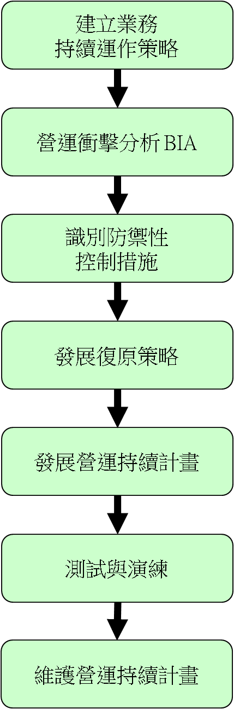

#
- 重要相關名詞：BCP 與 BCM
- [營運持續管理的國際標準 ISO 22301]()


# BCP(Business continuity planning)
- [NIST Special Publication (SP) 800-34, Revision 1, Contingency Planning Guide for Federal Information Systems](https://nvlpubs.nist.gov/nistpubs/legacy/sp/nistspecialpublication800-34r1.pdf)

- [Business continuity planning](https://en.wikipedia.org/wiki/Business_continuity_planning)

BCO

BCM


```
業務持續運作-目的
防止業務活動中斷，確保重要核心業務流程不受重大故障與災難的影響
結合預防與復原措施，將風險造成的影響降低到可以接受的等級
分析災難、安全缺失及服務損失的後果。制定與實施應變計畫，確保在要求的時間內恢復業務流程
選用控制措施降低風險，限制破壞性事件造成的後果，確保重要作業能及時復原
```


### 企業營運持續計畫
```
[44]在訂定企業營運持續計畫時，下列何者是首要進行的事？
(A) 訂定災難復原計畫（Disaster Recovery Plan， DRP）
(B) 執行營運衝擊分析（Business Impact Analysis， BIA）
(C) 獲得高階管理階層的支持
(D) 鑑別關鍵性業務
```
C
```
下列何者與營運持續計畫之規劃的關聯度較低？
(A) 風險評鑑的結果
(B) 可接受RTO（回復時間目標）、RPO（回復點目標）的標準
(C) 營運衝擊分析的結果
(D) 資訊資產的盤點結果
```
D
```
(D)與風險評鑑有關
```
```
[135]關於營運持續管理處理策略之選擇，下列敘述何者不正確?
(A) 轉移風險(Transfer)    (B) 避免風險(Avoid)
(C) 調整風險(Adjust)      (D) 接受風險(Accept)
```
C
```
風險接受
風險降低
風險移轉
風險避免
```
### 營運持續管理的國際標準 ISO 22301
```
[43]下列何者是營運持續管理的國際標準？
(A) ISO 9000   (B) ISO 14000   (C) ISO 20000   (D) ISO 22301
```
C
myanswer:D
```
https://www.bsigroup.com/zh-TW/ISO-22301-Business-Continuity/
ISO 22301 營運持續管理

ISO 9000系列標準是國際標準化組織設立的標準，與品質管理系統有關。

ISO 14000是一系列與環境管理相關的標準，旨在幫助組織最大程度地減少其運營對環境的負面影響。

ISO 20000是資訊業的資訊服務標準
```

## 1_建立業務持續運作策略

```
定義出機關業務持續運作的策略
法律、規範及合約的要求：相關法律、規範及合約要求機關業務持續運作方面的要求，是基本必須達到的最低要求
定義範圍：定義業務持續運作管理的範圍，可以從BCP需要處理的災害類型(例如：天災與人禍)來定義，也可以從業務範圍或特定區域與特定業務來定義
參與角色：可以包含下列人員與部門
計畫主要負責人
各部門主管與高階管理人
IT部門、安全部門及通訊部門
法務部門
當災害發生時需要執行BCP計畫的部門都應參與BCP的發展

```
## 2_營運衝擊分析(Business Impact Analysis):BIA
```
用來瞭解當災害發生後的嚴重程度，

BIA的步驟
識別組織的關鍵業務功能
計算關鍵業務
最大可承受中斷時間 (Max. Tolerable Period of Disruption, MTPD)
目標回覆時間(Recovery Time Objective, RTO)
各營運活動可容忍資料遺失之期間(Recovery Point Objective, RPO)
最低服務水準 (Min service level)
```

```
[140]您是資安專家，希望能估計營運可承受之最長中斷時間(Maximum Tolerable Period of Disruption)，
而您最有可能從下列何者取得?
(A) 平衡計分卡(Balanced Score Card)   (B) 風險估算(Risk Evaluation)
(C) 恢復點目標(Recovery Point Objective)  (D) 營運衝擊分析(Business Impact Analysis)
```
D

## 3_識別防禦性控制措施
```
完成關鍵性業務的風險分析後，應該可以清楚了解面臨的威脅、弱點、可能性及衝擊大小，接下來便需要規劃，有哪些威脅或弱點是可以預先被處理的，
透過防禦性控制措施「防止災害發生」或「降低災害發生時之損害程度」，分別舉例如下：
可防禦之災害(可採取避免損害發生的措施)
人為疏失：透過宣導與演練避免人員的疏失
資料毀損：透過異地備份技術，避免資料因火災而毀損
資源來源(電力)中斷：自建UPS與發電機組
不可防禦之災害(應採取降低損害程度的措施)
地震：強化建物結構與固定機房設備避免掉落
水災：加高防水匣門與增購抽水機組
```
## 4_發展復原策略
```

目的
指導復原作業的規劃方式與規模(成本)
參考
核心業務最大容許中斷時間
必須包含下列復原策略
業務流程復原策略
設施場所復原策略
供應與技術復原策略
使用者環境復原策略
資料復原策略
業務流程復原策略
其他業務處理流程(自動 vs 人工)
業務處理流程重建


在最大容許中斷時間的考量下，應決定採用何種設施場所備援機制，通常設施場所備援方式可分Hot Site、Warm Site或Cold Site三種選項
Hot Site： 已備妥大部分所需的場所、設施及軟硬體，只要花數個小時的時間就可以回復運作，但投入的成本最高
Warm Site： 已備妥相關場所與設施，但只準備部分較難準備的軟硬體，復原時還需額外準備其他軟硬體設備，需要花費1天或更長的時間來復原，投入成本較Hot Site為低
Cold Site： 只備妥相關場所與設施，缺乏軟硬體設備，復原需要數天的時間，但成本是最低的
機關除了向服務業者租用所需的場所外，也可以採用「同業互惠合作」、「自建備援場所」及「自建分散式多重處理機制」的方式考量設施場所的復原策略
同業互惠合作：與其他類似性質與層級之政府機關合作，彼此分享備援場所與設備，例如：高雄市政府與高雄縣政府各規劃一個空間當作彼此的備援機房
自建備援場所：在經費預算足夠且場所的要求有其特殊性或安全性考量時，可採用自行建立的方式
自建分散式多重處理機制：機關本身組織夠大，有機房分散在北、中、南時，可考慮將系統分散在不同位置處理，當一個機房受到損害時，其他的機房可立即接替受損機房的所有業務
機關在選擇備援場所的位置時，應與主要場所間有足夠合理的距離，以避免因同一災害反而兩邊同時受損的風險


供應與技術復原策略，應包含下列項目，並思考所需資源是否要事先準備？或者與廠商簽訂緊急租賃合約？
網路與電腦設備
語音與資料通訊
人力資源
人員與設備的運送
作業環境(空調等) 
資料與人員安全
耗材
文件
使用者環境復原策略
發展災害情況下的通報網：當災害發生造成現有通報機制損害時，應如何通報相關人員？個人使用的手機應該是目前相當合適的方案
識別關鍵使用者以利核心業務的運作：有哪些使用者為關鍵使用者？其備援人員是誰？應該識別清楚
必要時發展人員運送至備援場所的程序：當啟用備援場所時，大部分的人員立即會面臨交通上的問題，機關可視需要集中準備交通工具(例如巴士)運送相關人員到備援場所


資料復原策略：資料復原的方式受到其備份方式的影響，機關考量最大可容許中斷時間規劃資料備份與復原的機制
線上備份：在系統提供服務時，同時進行資料備份，亦即用戶仍可存取資料，但是伺服器效能會受影響，而且開啟的檔案可能無法備份
離線備份：系統必須中斷服務或在用戶暫停存取資料下進行備份，具有較佳的備份效能，而且可以完整的備份所有檔案
異地備份：定時將備份的資料送到異地備援場所保管，備份的傳送方式可採網路傳送或備份媒體的運送。注意傳送與運輸時資料的保護
異地備援：即時將資料備份到異地備援的系統，是最昂貴的作法，但資料復原的速度也最快
其他注意事項
備援與復原機制的選擇應考量成本效益與復原時效
備份與備援機制上的安全要求應與線上相同，備份資料也包含與線上系統相同的機敏資料
備份與備援機制應定期測試與演練，確保備份資料可被正常回存後使用


發展復原策略是撰擬BCP的前置作業，復原策略發展之目的為「指導復原作業的規劃方式與規模(成本)」，並應參考最大容許中斷時間的要求訂定。例如：在核心業務最大容許中斷時間為 8 小時的需求下，設施場所復原策略就應該選擇以Hot Site的方式規劃備援場所，以利核心業務的復原確保可以在8小時內完成
必須包含下列復原策略
業務流程復原策略
設施場所復原策略
供應與技術復原策略
使用者環境復原策略
資料復原策略
業務流程復原策略
其他業務處理流程(自動 vs 人工)：是否考量採用其他業務處理流程？例如：改用人工作業流程，也是一種可以被接受的策略，但人員訓練的內容，是否包含在沒有自動化系統的情況下，如何以人工處理流程執行核心業務？
業務處理流程重建：改用較簡單的作業流程，也許會喪失某些較不重要的控制環節，但還是可以讓核心業務順利運作


資料復原策略：資料復原的方式受到其備份方式的影響，機關考量最大可容許中斷時間規劃資料備份與復原的機制
線上備份：在系統提供服務時，同時進行資料備份，亦即用戶仍可存取資料，但是伺服器效能會受影響，而且開啟的檔案可能無法備份
離線備份：系統必須中斷服務或在用戶暫停存取資料下進行備份，具有較佳的備份效能，而且可以完整的備份所有檔案
異地備份：定時將備份的資料送到異地備援場所保管，備份的傳送方式可採網路傳送或備份媒體的運送。注意傳送與運輸時資料的保護
異地備援：即時將資料備份到異地備援的系統，是最昂貴的作法，但資料復原的速度也最快
其他注意事項
備援與復原機制的選擇應考量成本效益與復原時效
備份與備援機制上的安全要求應與線上相同，備份資料也包含與線上系統相同的機敏資料
備份與備援機制應定期測試與演練，確保備份資料可被正常回存後使用

```
## 5_業務持續運作:: 管理程序  see NIST SP 800-34  Chapter 3. Information System Contingency Planning Process
```
1. Develop the contingency planning policy;
2. Conduct the business impact analysis (BIA);
3. Identify preventive controls;
4. Create contingency strategies;
5. Develop an information system contingency plan;
6. Ensure plan testing, training, and exercises; and
7. Ensure plan maintenance. 
```




```
業務持續運作管理程序包含下列步驟：
建立業務持續運作策略
營運衝擊分析
識別防禦性控制措施
發展復原策略
發展營運持續計畫
測試與演練
維護營運持續計畫
必須獲得高階管理人員「認同與支持」：業務持續運作管理是策略性的作業，如果高階管理人員的危機意識不足，很容易變成是「有做有交待」就可以的計畫，最後變成無用與無效的計畫文件
必須是核心業務所有相關部門投入，而非只是資訊部門的責任：雖然在資通安全課程中說明營運持續管理(BCM)，但並不是代表BCM一定是由資訊部門所主導，因為BCM的主軸是「核心業務」，是從「業務流程」的思維來規劃，因此必須要核心業務所有相關部門的投入，才可能完整BCM的作業
學員可參考NIST Special Publication 800-34 Rev. 1

```


## 5_發展營運持續計畫 see NIST SP 800-34  Chapter 4. Information System Contingency Plan Development

```
前言
目標
適用範圍
角色與權責
定義
啟動階段
通報作業程序
損害評估
計畫啟動
緊急處理程序
復原階段
移轉到備援系統
業務處理復原
復原程序
重建階段
場所復原
環境測試
作業遷移
附錄
  通報網路
  系統需求
```
```
啟動階段Activation and Notification Phase
：指災害發生後至決定啟動BCP的期間，應包含下列內容
緊急處理程序：當重大災害發生時首要任務就是相關緊急處理程序，目的是確保人員性命的安全並降低災害的損失，所以可視災害類型訂定不同的緊急處理程序，例如：
人員疏散程序
急救步驟(CPR)
火災緊急處理程序
地震緊急處理程序
損害評估程序：用來決定是否啟動BCP，通常定義簡單的判斷條件即可，不需要冗長的分析評估作業，因為在緊急狀況下，通常沒有足夠的時間可以做詳細的評估
復原人員的通報程序：一旦決定啟動BCP後，相關復原人員的「通報方式」與「通報內容」，必須事先定義清楚，讓復原人員了解狀況與所需的判斷資訊


復原階段Recovery Phase：
主要目的是讓核心業務回復至暫時可運作的狀態，所以本章節內容主要以相關的復原程序為主
復原程序：應包含各項「業務」與「所需資源」回復至可運作狀態的每一步動作，而且必須在可容許中斷的時間內完成

重建階段Reconstitution Phase
主要目的是讓核心業務從暫時運作狀態，在原地點或其他地點回復到一般正常作業
在重組後的新環境應執行相關系統與作業測試
由較不重要的業務功能先移轉至新環境
```
## 6_測試與演練
```
目的
檢驗BCP的可行性並補強未考量之缺陷
確保在可容許中斷時間內可完成復原作業
讓相關人員熟悉相關災害復原的作業
測試方式
檢核表測試(部門個別檢視BCP工作)
無法得知不同部門間的合作與溝通結果
整合測試(各部門一起檢視BCP過程)
無法模擬不同的災害類型或損壞情況來應變
狀況模擬測試(紙上模擬災害情境與復原過程)
缺乏實際執行復原與重建的經驗


測試方式
並行測試(實際將部分系統及業務移轉到備援場所，但原場所仍持續運作，可實際測試是否能在最大容許中斷時間內復原)，可能導致部分業務無法運作
完全中斷測試(中斷原場所系統及服務，實際摸擬BCP的復原階段與重建階段)
核心業務必須中斷一段時間
部分業務可能無法及時復原運作
重建階段演練時，資料若需回存到原系統，可能導致資料錯亂
測試與演練的時機
定期(每年)
BCP有重大變更時可額外進行

人員訓練的需求
BCP的目的
BCP的角色與權責
復原小組間的協調與溝通
處理回報程序
安全要求
各小組在不同階段中的工作
特定人員在不同階段中的責任
在測試與演練中學習
測試結果與經驗應被記錄
彙整測試結果並於測試後進行檢討，以改善現有BCP的缺失


```

## 7_維護營運持續計畫

```
目的
確保BCP可符合機關現況需求
BCP會因下列因素變成不符現況需求
科技的快速變動或軟體升級
機關組織變更(分工方式、合併或裁減)
人員異動
如何確保BCP可符合現況
指派專責人員或部門負責持續更新
將計畫的審查加入機關定期稽核項目
在變更控制程序中審查是否需要更新BCP
```

```
如何判斷BCP是正確且有效
在可容許中斷時間內可以復原
在暫時備援環境中的作業是適當可行的
備份資料可被成功回存
緊急處理人員、服務人員及合約要求人員在可接受的時間內可以到達
小組成員了解現有BCP內容
小組成員可執行BCP的職責
BCP與現況需求符合


```
